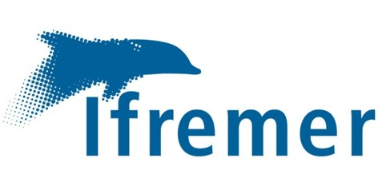
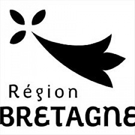
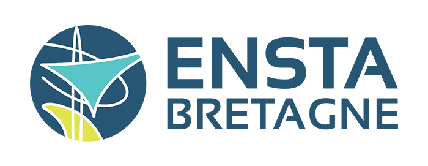
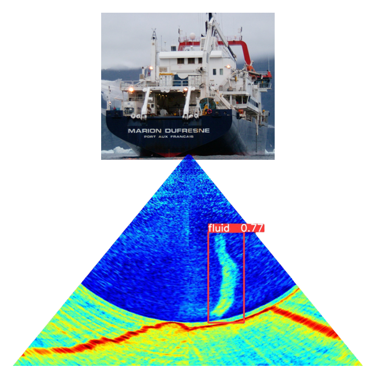

# *WAL*: Fluid emission detection- by *W*ater-column *A*coustics and deep *L*earning-approach

<div align="center">
<table>
  <tr>
    <td></td>
    <td></td>
    <td></td>
  </tr>
</table>
</div>


<div align="center">
<table>
  <tr>
    <td></td>
  </tr>
</table>
</div>

YOLOv5-WAL is a YOLOv5-based deep learning supervised approach to automate the detection of fluids emitted from cold seeps (gaseous methane) and volcanic sites (liquid carbon dioxide). Several thousand annotated echograms collected from different seas and oceans during distinct surveys were used to train and test the deep learning model. The tests were conducted on a dataset comprising hundreds of thousands of echograms i) acquired with three different multibeam echosounders (Kongsberg EM302 and EM122 and Reson Seabat 7150) and ii) characterized by variable water column noise conditions related to sounder artefacts and the presence of biomass (fishes, dolphins). 


This repository contains the code for inference with YOLOv5 and models trained for fluid emission detection on various Multibeam Echosounders (EM122, EM302, Reson Seabat 7150). This fluid detector was already used for near-real time acquisition detection during the cruises  [MAYOBS23 (EM122 - 2022)]([URL](https://campagnes.flotteoceanographique.fr/campaign?id=18002494)) and  [HAITI-TWIST (Seabat Reson 7150 - 2024)]([URL](https://campagnes.flotteoceanographique.fr/campagnes/18001258)).

Weights of the neural networks are available on the following doi:


## Table of Contents

- [*WAL*: Fluid emission detection- by *W*ater-column *A*coustics and deep *L*earning-approach](#wal-fluid-emission-detection--by-water-column-acoustics-and-deep-learning-approach)
  - [Table of Contents](#table-of-contents)
  - [How to install YOLOv5-WAL](#how-to-install-yolov5-wal)
  - [How to perform an inference on multi-beam data with GLOBE ](#how-to-perform-an-inference-on-multi-beam-data-with-globe-)
    - [Manual method](#manual-method)
    - [Bonus: Water column visualization](#bonus-water-column-visualization)
  - [Inference with YOLOv5-WAL example](#inference-with-yolov5-wal-example)
    - [Parameters to be set for the inference](#parameters-to-be-set-for-the-inference)
    - [Results](#results)
  - [Acknowlegdements](#acknowlegdements)
  - [Licence](#licence)
  - [Contact](#contact)


## How to install YOLOv5-WAL

Here is how to install the environment. 

```
git clone https://github.com/perrettymea/YOLO-WAL-fluid-detection-WCI-data
cd requirements
conda env create -f YOLOV5WAL.yml
conda activate YOLOV5WAL
```

## How to perform an inference on multi-beam data with GLOBE 

First, MBES data are acquired in raw format (e.g, .all/.wcd, .kmall, .s7k datagrams). For inference with YOLOv5-WAL it is necessary to convert them to a Cartesian representation for each ping. This can be done using the GLOBE software. GLOBE (GLobal Oceanographic Bathymetry Explorer) is an innovative application for processing and displaying oceanographic data. GLOBE provides processing and display solutions for multi-sensor data (such as water column MBES data). GLOBE can be downloaded [here](https://www.seanoe.org/data/00592/70460/) for Linux and Windows.

### Manual method


Converting the raw file into a g3D file:

* Load your raw file by clicking on: Data :arrow_forward: Import :arrow_forward:Load data file

* Convert your raw file in XSF (following the SONAR-netcf4 convention for sonar data).
<div align="center">
<table>
  <tr>
    <td></td>
  </tr>
</table>
</div>

Select **xsf** output format and where you want to save this new file. 


* This file is not already in cartesian representation so we to need to convert it in G3D netcdf format (WC Polar Echograms).

<div align="center">
<table>
  <tr>
    <td></td>
  </tr>
</table>
</div>

It is possible to configure:
* Parameters for interpolation (from polar to cartesian representation)
* Filtering for dB value, bottom detection, sidelobe, beam index, depth or across distance.
* Subsampling
* Layers you want to export: backscatter (mean, max). We do not advise to consider *bacscatter_comp* layers for this detection case.
  
:heavy_check_mark: This G3D contains the following informations that you can access:


```
Groups:
  Group: [Ping number]

  Variables:
        elevation: ('vector', 'position') float32
          Attributes:
            units: meters
            long_name: elevation
            standard_name: elevation
        longitude: ('vector', 'position') float64
          Attributes:
            units: degrees_east
            long_name: longitude
            standard_name: longitude
        latitude: ('vector', 'position') float64
          Attributes:
            units: degrees_north
            long_name: latitude
            standard_name: latitude
        backscatter_mean: ('height', 'length') float32
          Attributes:
            units: dB
            long_name: backscatter_mean
            standard_name: backscatter_mean
```

This manual method must be used for all raw files before inference. 


:arrow_forward:If you have other software/code that can extract pings from the water column and represent it as a 2D-cartesian-matrix format (numpy, as with g3D), you can direct it to the neural network for inference. As neural networks were not trained on our specific format, be careful to fit with g3D outputs.

### Bonus: Water column visualization

GLOBE can also help you to visualize your water column 2D data by selecting the **xsf** file :arrow_forward: Open with :arrow_forward: Water Column 2D viewer. This tool will allows you to visualize Water Column Images ping per ping.

## Inference with YOLOv5-WAL example

Python code for inference can be run using the following line:

```
python inference_on_G3D.py  --name_acquisition DEMO --confidence_threshold 0.3 --name_model GHASS2_Reson_Seabat.pt --dB_min 20 --dB_max 70
```

### Parameters to be set for the inference


* *G3D*: Path to the folder containing G3D files for inference (default: 'G3D')
* *results*: Path to save inference results (default: 'RESULTS')
* *folder_model*: Path to the folder containing model weights (default: 'NETWORKS')
* *name_acquisition*: Name of the inference experiment (default: 'TEST_INFERENCE')
* *name_model*: Name of the model file to use, including .pt extension (default: 'training_test_with_G3D.pt')
* *confidence_threshold*: Threshold for discriminating detections (default: 0.3)
* *size_img*: Size to resize images before inference, has to be a multiple of 32 as detailed in YOLOv5 documentation (will be resized if not) (default: 960)
* *dB_min*: Minimum dB value for data normalization (default: -50)
* *dB_max*: Maximum dB value for data normalization (default: 10)

dB_min/dB_max allow to normalize data for inference. Values below dB_min an above dB_max will be clipped to this value. You have to fix these limits in order to see properly your fluid echoes, used for example the limits of the colorbar you used. In the event that the dB_min/dB_max values are not adequately defined, the resulting inference will be of poor quality. This is due to the fact that the discrepancy between the features of the training and inference data will be too significant. You have to fix these limits in order to see properly your fluid echoes.

For more documentation YOLOv5 training see : [YOLOv5 documentation](https://github.com/ultralytics/yolov5)


### Results

<div align="center">
<table>
  <tr>
    <td></td>
  </tr>
</table>
</div>

(Here *db_min* and *dB_max* are very high, du to a Reson Seabat 7150 specificity). Folders are created, one with the images on which the detections are made and one with the coordinates of the detections, sorted by the original G3D file.

<div align="center">
<table>
  <tr>
    <td></td>
  </tr>
</table>
</div>


The coordinates of the detections can be used for visualisation in a Geographic Information System and correspond to the mid-point of the detection box. 
The following parameters were recorded for each detection:

| **Parameter**                     | **Description**                                          |
|-----------------------------------|---------------------------------------------------------|
| **Longitude (WGS84)**             | Longitude of the detected object (center of the box).                       |
| **Latitude (WGS84)**                      | Latitude of the detected object (center of the box).                        |
| **Average Depth**               | Average depth calculated as \((h_{\text{min box}} + h_{\text{max box}}) / 2\). |
| **File Name**                    | Name of the file where the detection occurred.         |
| **Ping**                         | The specific ping number associated with the detection. |
| **Box Coordinates**              | Coordinates of the bounding box in the image (in pixels).          |
| **Confidence Index**             | Confidence score of the detection from the model.      |


This file (in *coord_detections_center* folder) can be loaded in GLOBE using data :arrow_forward: Import :arrow_forward: Load data file :arrow_forward: Select your file:
Then select "point cloud" to describe this data and then select ASCII parameters:
<div align="center">
<table>
  <tr>
    <td></td>
  </tr>
</table>
</div>


Then right-click on your point-cloud file and "Go-to" to visualize these detections.
Here a visualization of our detections with the Water column 2D Viewer playing:


:star: For more details please refer to the following resources:
* :newspaper: Frontiers article link (Rules for training set composition)
* :newspaper:[Knowledge transfer for deep-learning gas-bubble detection in underwater acoustic water column data](https://www.ioa.org.uk/catalogue/paper/knowledge-transfer-deep-learning-gas-bubble-detection-underwater-acoustic-water) (How to train neural network for a cruise without having seep data on the MBES you want to use)
* :computer: [YOLOv5 documentation](https://github.com/ultralytics/yolov5)
* :computer:[GLOBE](https://www.seanoe.org/data/00592/70460/)

## Acknowlegdements

The GAZCOGNE1 marine expedition was part of the PAMELA project and was co-funded by TotalEnergies and IFREMER for the exploration of continental margins. The GHASS2 marine expedition was co-funded by the Agence Nationale de la Recherche for the BLAck sea MEthane (BLAME) project and IFREMER. MAYOBS21 and 23 were conducted by several French research institutions and laboratories, namely IPGP, CNRS, BRGM, and IFREMER. The project was funded by the Mayotte volcanological and seismological monitoring network (REVOSIMA), a partnership between IPGP, BRGM, OVPF-IPGP, CNRS, and IFREMER. This study presents the findings of a PhD project that was funded by IFREMER and the Brittany region through an ARED grant.

We wish to express our gratitude to the officers and crews of the research vessels Le Suroît, Pourquoi pas ?, and Marion Dufresne, as well as the technical staff from Genavir and Ifremer.

## Licence

This repository is under AGPL-3.0 as YOLOv5 from [Ultralytics](https://github.com/ultralytics/yolov5). This OSI-approved open-source license is ideal for students and enthusiasts, promoting open collaboration and knowledge sharing. See the LICENSE file for more details.

## Contact
:mailbox_with_no_mail: For questions or support, please contact tymea.perret@ifremer.fr.
