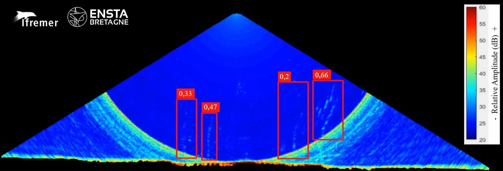

# *WAL*: Fluid emission detection- by *W*ater-column *A*coustics and deep *L*earning-approach

<div align="center">
<table>
  <tr>
    <td></td>
    <td></td>
    <td></td>
  </tr>
</table>
</div>

- [*WAL*: Fluid emission detection- by *W*ater-column *A*coustics and deep *L*earning-approach](#wal-fluid-emission-detection--by-water-column-acoustics-and-deep-learning-approach)
  - [How to install YOLOv5-WAL](#how-to-install-yolov5-wal)
  - [How to perform an inference on multi-beam data with GLOBE ](#how-to-perform-an-inference-on-multi-beam-data-with-globe-)
    - [Manual method](#manual-method)
    - [Bonus: Water column visualization](#bonus-water-column-visualization)
  - [Inference with YOLOv5-WAL example](#inference-with-yolov5-wal-example)
    - [Parameters to be set for the inference](#parameters-to-be-set-for-the-inference)
    - [Results](#results)
  - [Acknowlegdements](#acknowlegdements)
  - [Licence](#licence)
  - [Contact](#contact)

<div align="center">
  <table>
    <tr>
      <td>
        
      </td>
    </tr>
    <tr>
      <td align="center">
        <em>Neural network detections made on GHASS2 cruise water column data (Reson Seabat 7150)</em>
      </td>
    </tr>
  </table>
</div>

YOLOv5-WAL is a YOLOv5-based deep learning supervised approach to automate the detection of fluids emitted from cold seeps (gaseous methane) and volcanic sites (liquid carbon dioxide). Several thousand annotated echograms collected from different seas and oceans during distinct surveys were used to train and test the deep learning model. The tests were conducted on a dataset comprising hundreds of thousands of echograms i) acquired with three different multibeam echosounders (Kongsberg EM302 and EM122 and Reson Seabat 7150) and ii) characterized by variable water column noise conditions related to sounder artefacts and the presence of biomass (fishes, dolphins).


This repository contains the code for inference with YOLOv5. 

Models trained for fluid detection issued from several multibeam echosounders (Kongsberg EM122, EM302, Reson Seabat 7150) can be found here. This fluid detector was already used for near-real time acquisition detection during the MAYOBS23 (EM122 – 2022; Perret et al. 2023) and HAITI-TWIST (Seabat Reson 7150 - 2024) cruises.


## How to prepare multibeam data with GLOBE software (if necessary) for subsequent inference


Here is how to install the environment (assuming git is already a package in your anaconda distribution). 

```
git clone https://github.com/perrettymea/YOLO-WAL-fluid-detection-WCI-data
cd YOLO-WAL-fluid-detection-WCI-data
cd requirements
conda env create -f YOLOV5WAL.yml
conda activate YOLOV5WAL
```

## How to perform an inference on multi-beam data with GLOBE 

Multibeam data are acquired in raw format (e.g, .all/.wcd, .kmall, .s7k datagrams). For inference with YOLOv5-WAL it is necessary to convert them to a Cartesian representation for each ping. This can be done using the GLOBE software. GLOBE (GLobal Oceanographic Bathymetry Explorer) is an innovative application for processing and displaying oceanographic data. GLOBE provides processing and display solutions for multi-sensor data (such as water column multibeam data). GLOBE can be downloaded [here](https://www.seanoe.org/data/00592/70460/) for Linux and Windows.

### Manual method


Converting the raw file into a g3D file:

* Load your raw file by clicking on: Data :arrow_forward: Import :arrow_forward:Load data file

* Convert your raw file in XSF (following the SONAR-netcf4 convention for sonar data). Select **xsf** output format and where you want to save this new file. 

<div align="center">
  <table>
    <tr>
      <td>
        
      </td>
    </tr>
    <tr>
      <td align="center">
        <em>Conversion from raw water column format to XSF format using GLOBE software</em>
      </td>
    </tr>
  </table>
</div>


* Convert the XSF file in G3D netcdf format (WC Polar Echograms) to obtain a cartesian representation


<div align="center">
  <table>
    <tr>
      <td>
        
      </td>
    </tr>
    <tr>
      <td align="center">
        <em>Conversion from XSF format to G3D format using GLOBE software</em>
      </td>
    </tr>
  </table>
</div>

It is possible to configure:
* Parameters for interpolation (from polar to cartesian representation)
* Filtering for dB value, bottom detection, sidelobe, beam index, depth or across distance. We advise to use WCIs cut after bottom detection.
* Subsampling
* Layers you want to export: backscatter (mean, max). We do not advise to consider *bacscatter_comp* layers for this fluid detection case.
  
:heavy_check_mark: This G3D contains the following informations that you can access:


```
Groups:
  Group: [Ping number]

  Variables:
        elevation: ('vector', 'position') float32
          Attributes:
            units: meters
            long_name: elevation
            standard_name: elevation
        longitude: ('vector', 'position') float64
          Attributes:
            units: degrees_east
            long_name: longitude
            standard_name: longitude
        latitude: ('vector', 'position') float64
          Attributes:
            units: degrees_north
            long_name: latitude
            standard_name: latitude
        backscatter_mean: ('height', 'length') float32
          Attributes:
            units: dB
            long_name: backscatter_mean
            standard_name: backscatter_mean
```

This manual method must be used for all raw files before inference. 


:arrow_forward:If you have another software/code than Globe that can extract pings from the water column and represent it as a 2D-cartesian-matrix format (numpy, as with g3D), you can direct it to the neural network for inference.

### Bonus: Water column visualization

GLOBE can also help you to visualize 2D water column data ping per ping by selecting the **xsf** file :arrow_forward: Open with :arrow_forward: Water Column 2D viewer. 

## Inference with YOLOv5-WAL: an example

Python code for inference can be run using the following line (models have to be downloaded from SENAO repository):

```
python inference_on_G3D.py  --name_acquisition DEMO --confidence_threshold 0.3 --name_model GHASS2_Reson_Seabat.pt --dB_min 20 --dB_max 70
```

### Parameters to be set for the inference


* *G3D*: Path to the folder containing G3D files for inference (default: 'G3D')
* *results*: Path to save inference results (default: 'RESULTS')
* *folder_model*: Path to the folder containing model weights (default: 'NETWORKS')
* *name_acquisition*: Name of the inference experiment (default: 'TEST_INFERENCE')
* *name_model*: Name of the model file to use, including .pt extension (default: 'training_test_with_G3D.pt')
* *confidence_threshold*: Threshold for discriminating detections (default: 0.3)
* *size_img*: Size to resize images before inference, has to be a multiple of 32 as detailed in YOLOv5 documentation (will be automatically resized if not) (default: 960)
* *dB_min*: Minimum dB value for data normalization (default: -50)
* *dB_max*: Maximum dB value for data normalization (default: 10)

dB_max will be clipped to these values. 
You have to fix these limits in order to properly see fluid echoes as it will fix your colourbar. In the case of dB_min/dB_max values not adequately defined, the resulting inference will be of poor quality. This is due to the fact that the discrepancy between the features of the training and inference data will be too significant.

For more documentation YOLOv5 training see : [YOLOv5 documentation](https://github.com/ultralytics/yolov5)


### Results

<div align="center">
  <table>
    <tr>
      <td>
        
      </td>
    </tr>
    <tr>
      <td align="center">
        <em>Terminal interface during the inference execution.</em>
      </td>
    </tr>
  </table>
</div>

(Here *db_min* and *dB_max* are very high, due to a Reson Seabat 7150 specificity, for a Kongsberg multibeam -60 (*db_min*) to -10 (*db_max*) could be appropriate values).
Two folders are created, one with the images for which the detections are made and another one with the coordinates of the detections, with a subfolder per G3D file.

<div align="center">
  <table>
    <tr>
      <td>
        
      </td>
    </tr>
    <tr>
      <td align="center">
        <em>Example of a detection generated through YOLOv5 inference on a Reson Seabat 7150 multibeam echogram.</em>
      </td>
    </tr>
  </table>
</div>


The coordinates of the detections correspond to the mid-point of the detection box and can be used for visualisation for instance in a Geographic Information System. The following parameters are recorded for each detection:


| **Parameter**                     | **Description**                                          |
|-----------------------------------|---------------------------------------------------------|
| **Longitude (WGS84)**             | Longitude of the detected object (centre of the box).                       |
| **Latitude (WGS84)**                      | Latitude of the detected object (centre of the box).                        |
| **Average Depth**               | Average water depth calculated as \((h_{\text{min box}} + h_{\text{max box}}) / 2\). |
| **File Name**                    | Name of the file where the detection occurred.         |
| **Ping**                         | The specific ping number associated with the detection. |
| **Box Coordinates**              | Coordinates of the bounding box in the image (in pixels).          |
| **Confidence Index**             | Confidence score of the detection from the model.      |


This file (in *coord_detections_center folder*) can be loaded for instance in GLOBE using data > Import > Load data file. 
Then select “point cloud” to describe this data and choose ASCII parameters.
<div align="center">
  <table>
    <tr>
      <td>
        
      </td>
    </tr>
    <tr>
      <td align="center">
        <em>Configuration settings to load detection coordinates in Globe</em>
      </td>
    </tr>
  </table>
</div>

Then right-click on your point-cloud file and "Go-to" to visualize these detections.
Here a visualization of fluid detections with the Water column 2D Viewer player:


  *WC 2D player with fluid echoes on Water Column Images, centre of boxes detected are in red*

:star: For more details please refer to the following resources:
* :newspaper: Frontiers article link (Rules for training set composition)
* :newspaper:[Knowledge transfer for deep-learning gas-bubble detection in underwater acoustic water column data](https://www.ioa.org.uk/catalogue/paper/knowledge-transfer-deep-learning-gas-bubble-detection-underwater-acoustic-water)(How to train neural network without fluid echograms from the multibeam echosounder you use)
* :computer: [YOLOv5 documentation](https://github.com/ultralytics/yolov5)
* :computer:[GLOBE](https://www.seanoe.org/data/00592/70460/)

## Acknowledgements

The GAZCOGNE1 and PAMELA-MOZ01 marine expeditions were part of the PAMELA project and were co-funded by TotalEnergies and IFREMER for the exploration of continental margins. The GHASS2 marine expedition was co-funded by the Agence Nationale de la Recherche for the BLAck sea MEthane (BLAME) project and IFREMER. MAYOBS23 was conducted by several French research institutions and laboratories, namely IPGP, CNRS, BRGM, and IFREMER. The project was funded by the Mayotte volcanological and seismological monitoring network (REVOSIMA), a partnership between IPGP, BRGM, OVPF-IPGP, CNRS, and IFREMER. This study is part of a PhD project funded by IFREMER and the Brittany region through an ARED grant. 

## Licence

This repository is under AGPL-3.0 as YOLOv5 from [Ultralytics](https://github.com/ultralytics/yolov5). This OSI-approved open-source license is ideal for students and enthusiasts, promoting open collaboration and knowledge sharing. See the LICENSE file for more details.

## Contact
:mailbox_with_no_mail: For questions or support, please contact tymea.perret@ifremer.fr.
