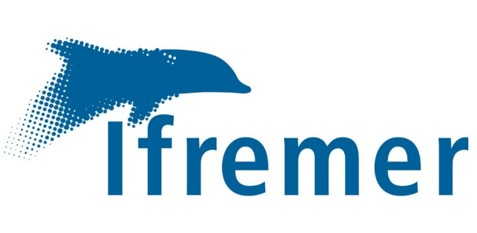
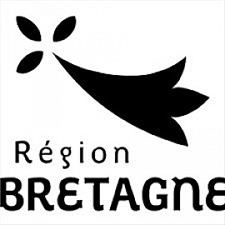
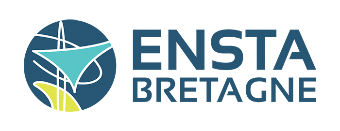
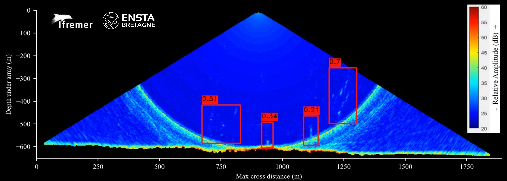

# *YOLO-WAL*: Fluid-emission detection by *W*ater-column *A*coustics and a deep-*L*earning-approach

<div align="center">
<table>
  <tr>
    <td></td>
    <td></td>
    <td></td>
  </tr>
</table>
</div>

- [*YOLO-WAL*: Fluid-emission detection by *W*ater-column *A*coustics and a deep-*L*earning-approach](#wal-fluid-emission-detection--by-water-column-acoustics-and-deep-learning-approach)
  - [How to install YOLOv5-WAL](#how-to-install-yolov5-wal)
  - [How to prepare multibeam data with GLOBE software (if necessary) for subsequent inference](#how-to-perform-an-inference-on-multi-beam-data-with-globe-)
    - [Manual method](#manual-method)
    - [Bonus: Water-column visualization](#bonus-water-column-visualization)
  - [Inference with YOLOv5-WAL: an example](#inference-with-yolov5-wal-example)
    - [Parameters to be set for the inference](#parameters-to-be-set-for-the-inference)
    - [Results](#results)
  - [Training — YOLO-WAL Fluid Detection on WCI Data](#Training-—-YOLO-WAL-Fluid-Detection-on-WCI-Data)
    - [Environment Setup](#Environment-Setup)
    - [Install Comet ML for monitoring](#Install-Comet-ML-for-monitoring-(recommended-but-not-mandatory))
    - [Training dataset(s)](#Training-dataset(s))
    - [Running Training](#Running-Training)
  - [Share Your Weights with the Community](#Share-Your-Weights-with-the-Community)
  - [Troubleshooting (not exhaustive)](#Troubleshooting)
  - [Acknowledgements](#acknowlegdements)
  - [Licence](#licence)
  - [Citation](#citation)
  - [Contact](#contact)

<div align="center">
  <table>
    <tr>
      <td>
        
      </td>
    </tr>
    <tr>
      <td align="center">
        <em>Neural network detections made on GHASS2 cruise water column data (Reson Seabat 7150)</em>
      </td>
    </tr>
  </table>
</div>

YOLOv5-WAL is a YOLOv5-based deep learning supervised approach to automate the detection of fluids emitted from the seafloor (e.g. methane bubbles from cold seeps and liquid carbon dioxide from volcanic sites). It concerns the detection of fluids in water column images (echograms) acquired with multibeam echosounders. Several thousand annotated echograms from different seas and oceans and acquired during distinct surveys were used to train and test the deep-learning model. The tests were conducted on a dataset comprising hundreds of thousands of echograms i) acquired with three different multibeam echosounders (Kongsberg EM302 and EM122 and Reson Seabat 7150) and ii) characterized by varied water-column noise conditions related to sounder artefacts and the presence of biomass (e.g. fish, dolphins).
This repository contains the code for inference with YOLOv5. 

Models trained for fluid detection issued from several multibeam echosounders (Kongsberg EM122, EM302, Reson Seabat 7150) could be downloaded from [SEANOE repository](https://www.seanoe.org/data/00923/103478/). This fluid detector was already used for near-real time acquisition detection during the MAYOBS23 (EM122 – 2022; Perret et al. 2023) and HAITI-TWIST (Seabat Reson 7150 - 2024) cruises.


## How to install YOLOv5-WAL

Here is how to install the environment (assuming git is already a package in your anaconda distribution). 

```
git clone https://github.com/perrettymea/YOLO-WAL-fluid-detection-WCI-data
cd YOLO-WAL-fluid-detection-WCI-data
cd requirements
conda env create -f YOLOV5WAL.yml
conda activate YOLOV5WAL
```

## How to prepare multibeam data with GLOBE software (if necessary) for subsequent inference

Multibeam data are acquired in raw format (e.g, .all/.wcd, .kmall, .s7k datagrams). For inference with YOLOv5-WAL it is necessary to convert them to a Cartesian representation for each ping. This can be done using the GLOBE software. GLOBE (GLobal Oceanographic Bathymetry Explorer) is an innovative application for processing and displaying oceanographic data. GLOBE provides processing and display solutions for multi-sensor data (such as water column multibeam data). GLOBE can be downloaded [here](https://www.seanoe.org/data/00592/70460/) for Linux and Windows.

### Manual method

Converting the raw file into a g3D file:

* Load your raw file by clicking on: Data :arrow_forward: Import :arrow_forward:Load data file

* Convert your raw file into XSF (following the SONAR-netcf4 convention for sonar data). Select **xsf** output format and where you want to save this new file. 

<div align="center">
  <table>
    <tr>
      <td>
        
      </td>
    </tr>
    <tr>
      <td align="center">
        <em>Conversion from raw water column format to XSF format using GLOBE software</em>
      </td>
    </tr>
  </table>
</div>


* Convert the XSF file into G3D netcdf format (WC Polar Echograms) to obtain a cartesian representation


<div align="center">
  <table>
    <tr>
      <td>
        
      </td>
    </tr>
    <tr>
      <td align="center">
        <em>Conversion from XSF format to G3D format using GLOBE software</em>
      </td>
    </tr>
  </table>
</div>

It is possible to configure:
* Parameters for interpolation (from polar to cartesian representation)
* Filtering for dB value, bottom detection, sidelobe, beam index, depth or across distance. We advise to use WCIs cut after bottom detection.
* Subsampling
* Layers you want to export: backscatter (mean, max). We do not advise to consider *bacscatter_comp* layers for this fluid detection case.
  
:heavy_check_mark: This G3D contains the following information that you can access:

<details>
<summary><strong>G3D variables</strong> (click to expand)</summary>
  
```
Groups:
  Group: [Ping number]

  Variables:
        elevation: ('vector', 'position') float32
          Attributes:
            units: meters
            long_name: elevation
            standard_name: elevation
        longitude: ('vector', 'position') float64
          Attributes:
            units: degrees_east
            long_name: longitude
            standard_name: longitude
        latitude: ('vector', 'position') float64
          Attributes:
            units: degrees_north
            long_name: latitude
            standard_name: latitude
        backscatter_mean: ('height', 'length') float32
          Attributes:
            units: dB
            long_name: backscatter_mean
            standard_name: backscatter_mean
```

This manual method must be used for all raw files before inference. 

</details>

:arrow_forward:If you have software/code other than Globe that can extract pings from the water column and represent it as a 2D-cartesian-matrix format (numpy, as with g3D), you can direct it to the neural network for inference.


GLOBE can also help you to visualize 2D water column data ping per ping by selecting the **xsf** file :arrow_forward: Open with :arrow_forward: Water Column 2D viewer. 

## Inference with YOLOv5-WAL: an example

Python code for inference can be run using the following line (models could be downloaded from [SEANOE repository](https://www.seanoe.org/data/00923/103478/):

```
python inference_on_G3D.py  --name_acquisition DEMO --confidence_threshold 0.3 --name_model GHASS2_Reson_Seabat.pt --dB_min 20 --dB_max 70
```

Or, to avoid retyping every flag, use a config file (to adapt for your needs) (any flag also given on the command line
overrides the file):

```bash
python inference_on_G3D.py --config example_config.json
```

<details>
<summary><strong>Configuration parameters to be set for the inference</strong> (click to expand)</summary>

| Flag | Type | Default | Description |
|------|------|---------|-------------|
| `--G3D` | path | `G3D` | Folder containing the input `.nc` files. |
| `--results` | path | `RESULTS` | Folder where outputs are written. |
| `--folder_model` | path | `NETWORKS` | Folder containing the model weights file. |
| `--name_model` | str | `training_test_with_G3D.pt` | Weights filename (with `.pt`). |
| `--name_acquisition` | str | `TEST_INFERENCE` | Name of this inference run; used as the top-level output folder. |
| `--confidence_threshold` | float | `0.2` | Minimum detection confidence kept, in [0, 1]. |
| `--size_img` | int | `960` | Size to resize images before inference, must be a multiple of 32 as detailed in YOLOv5 documentation (automatically resized if not) (match your training size). |
| `--dB_min` / `--dB_max` | int | `-50` / `10` | dB range mapped to pixel intensity 0–255. |
| `--colormap` | str | `gray` | Colormap for saved annotated PNGs only (detection always runs on plain grayscale). One of: `gray`, `jet`, `turbo`, `viridis`, `inferno`, `magma`, `hot`, `bone`, `ocean`. |
| `--batch_size` | int | `1` | Pings sent to the model per inference call. Higher is generally faster on GPU, within your VRAM budget. |
| `--overwrite` | flag | off | Reprocess `.nc` files even if already marked done. |
| `--device` | str | `auto` | `auto`, `cpu`, `cuda`, or `cuda:N`. |
| `--config` | path | — | JSON/YAML file with any of the above keys; CLI flags override it. |
| `--dump_config` | path | — | Write current effective arguments to this JSON path and exit. |


*dB_min* and *dB_max* allow to normalize data for inference. Values below *dB_min* and above *dB_max* will be clipped to these values.  You must fix these limits to properly see fluid echoes as it will fix your colour bar. In the case of inadequately defined *dB_min/dB_max* values, the resulting inference will be of poor quality. This is due to an excessive discrepancy between the features of the training and inference data.
For more YOLOv5 training documentation see: [YOLOv5 documentation](https://github.com/ultralytics/yolov5)
</details>


<div align="center">
  <table>
    <tr>
      <td>
        
      </td>
    </tr>
    <tr>
      <td align="center">
        <em>Terminal interface during the inference execution.</em>
      </td>
    </tr>
  </table>
</div>

(Here *db_min* and *dB_max* are very high, due to a Reson Seabat 7150 specificity, for a Kongsberg multibeam -60 (*db_min*) to -10 (*db_max*) could be appropriate values).
Two folders are created, one with the images for detections and the other with the coordinates of the detections, with a subfolder per G3D file.

<div align="center">
  <table>
    <tr>
      <td>
        
      </td>
    </tr>
    <tr>
      <td align="center">
        <em>Example of a detection generated through YOLOv5 inference on a Reson Seabat 7150 multibeam echogram.</em>
      </td>
    </tr>
  </table>
</div>


```
<results>/<name_acquisition>/
├── boxes_images/<Layer>/…png          # annotated detection images
├── coord_detections_center/<Layer>….csv  # one row per detection
├── processed_markers/<Layer>.done     # written once a Layer is fully processed
└── run_manifest_<timestamp>.json      # parameters, environment, stats for this run
```


The coordinates of the detections correspond to the mid-point of the detection box and can be used for visualization for instance in a Geographic Information System. The following parameters are recorded for each detection:

<details>
<summary><strong>CSV column reference</strong> (click to expand)</summary>

| # | **Parameter**   | **Description** | **Unit / Type** |
|---|---------|-------------|---------------|
| 1 | `lon_moy` | Longitude of the horizontal center of the detection box| decimal degrees |
| 2 | `lat_moy` | Latitude of the horizontal center of the detection box | decimal degrees |
| 3 | `hmoy` | Average water depth of the box (`(hmin + hmax) / 2`) | meters |
| 4 | `hmin` | Water depth at the bottom of the box (calculated based on `ymax`) | meters |
| 5 | `hmax` | Water depth at the top of the box (calculated based on `ymin`) | meters |
| 6 | `Layer` | Layer/Acquisition Name (derived from the file name `.nc`) | str |
| 7 | `ping` | Ping number (NetCDF group), 5 digits | integer (str, zero-padded) |
| 8 | `width` | Actual width of the detection box | meters |
| 9 | `height` | Actual height of the detection box(`\|hmin - hmax\|`) | meters |
| 10 | `distance_to_nadir` | Distance from the center of the box to the nadir  | meters |
| 11 | `reject_box_sidelobe` | `True` if the box is deemed to be under the Minimum Slant Range (heuristic based on the assumption of a flat bottom) | Boolean |
| 12 | `range_max_before_msr` | Minimum Slant Range| meters |
| 13 | `distance_image_edge` | Vertical distance between the top of the box and the edge of the WCI | meters |
| 14 | `xmin` | Left edge of the box | pixels |
| 15 | `xmax` | Rigth edge of the boxe | pixels |
| 16 | `ymin` | Top edge of the box | pixels |
| 17 | `ymax` | Bottom edge of the box | pixels |
| 18 | `confidence` | Model confidence score for this detection | [0, 1] |
| 19 | `mean_WC_value` | Average WC value in the box (averaged on natural scale, converted to dB) | dB |
| 20 | `std_WC_value` | Standard deviation of WC value in the box | dB |
| 21 | `Q1_WC_value` | 1st quartile (25th percentile) of WC value | dB |
| 22 | `median_WC_value` | Median WC value | dB |
| 23 | `Q3_WC_value` | 3rd quartile (75th percentile) of WC value | dB |
| 24 | `percent_90_WC_value` | 90th percentile of WC value | dB |

</details>


A file whose Layer already has a marker under `processed_markers/` is skipped on the next run
unless `--overwrite` is passed. When a file is (re)processed, its previous outputs for that Layer
are deleted first, so resuming after an interruption never creates duplicate rows.

## Vizualisation of detections in GLOBE 
This file (in *coord_detections_center folder*) can be loaded for instance in GLOBE using data > Import > Load data file. 
Then select “point cloud” to describe this data and select ASCII parameters.
<div align="center">
  <table>
    <tr>
      <td>
        
      </td>
    </tr>
    <tr>
      <td align="center">
        <em>Configuration settings to load detection coordinates in Globe</em>
      </td>
    </tr>
  </table>
</div>

Then right-click on your point-cloud file and "Go-to" to visualize these detections.
Here a visualization of fluid detections with the Water column 2D Viewer player:

<div align="center">
  <table>
    <tr>
      <td>
        
      </td>
    </tr>
    <tr>
      <td align="center">
        <em>WC 2D player with fluid echoes on Water Column Images, centre of boxes detected are in red</em>
      </td>
    </tr>
  </table>
</div>


# Training — YOLO-WAL Fluid Detection on WCI Data

This section explains how to set up the training environment, structure your dataset, configure hyperparameters, monitor training with Comet ML, and share your weights with the community.

---

## Environment Setup

This workflow uses **YOLOv5 (2022 release)** from Ultralytics. YOLOv5 is alredy present in this repository. We recommend using a dedicated conda environment compatbible with GPU for the training (refers to Ultralytics YOLOv5 repository).


> **GPU users**: make sure PyTorch is installed with CUDA support matching your driver version.  
> Check: [https://pytorch.org/get-started/locally/](https://pytorch.org/get-started/locally/)


## Training dataset(s)

Download the training data from the link provided here (SEANOE) and organize your folder as follows:

```
dataset/
├── train/
│   ├── images/          # Training images (.png or .jpg)
│   ├── labels/          # YOLO-format annotation files (.txt)
└── validation/
    ├── images/          
    ├── labels/
```

This training data contains WCIs from different MBES (full description in SEANOE). You can add your proper WCIs by extracting images from your G3D (see higher how to converted your MBES watercolumn data in a G3D). Here is an exemple of a code you can use in this objective (colorbar and dB limits can be changed depending on your data).

<details>
<summary><strong>WCI extraction from g3D</strong> (click to expand)</summary>
  
```bash
import os
import shutil
import netCDF4 as nc
import numpy as np
import cv2


g3D_path = "your_g3d_path"
where2save_img = "where_to_save_your_images"
for nc_file_path in sorted(os.listdir(g3D_path)):
   nc_file = nc.Dataset(os.path.join(g3D_path, nc_file_path))
   name_line = nc_file_path.split(".")[0]
   for ping_g3D in nc_file.groups.keys():
      # Access the group in the NetCDF file
      group = nc_file.groups[ping_g3D]
      # Accessing specific variable
      variable_name = 'backscatter_mean'
      variable = group.variables[variable_name]
      # Retrieve the values of the variable
      valeurs_variable = variable[:]
      print(valeurs_variable.shape)
      if valeurs_variable.shape[0] > 0:
            valeurs_variable = np.flipud(valeurs_variable)
            # normalisation step: scale dB to 0.1
            # TODO: Choose thresholds to adjust the saturation of your water column images
            val_min = -50
            val_max = 20
            nan_mask = np.isnan(valeurs_variable)

            # Temporarily replace NaNs with a value outside the range for normalisation
            valeurs_variable_temp = np.nan_to_num(valeurs_variable, nan=val_min - 1)

            # Backscatter normalisation
            valeurs_variable_normalized = (valeurs_variable - val_min) / (val_max - val_min) * 255
            valeurs_variable_normalized = np.clip(valeurs_variable_normalized, 0, 255).astype(np.uint8)

            # TODO: Apply the jet colour scheme or any other scheme you deem appropriate to the input of your network
            #valeurs_variable_colormap = cv2.applyColorMap(valeurs_variable_normalized, cv2.COLORMAP_JET) #if in jet
            valeurs_variable_colormap = cv2.merge([valeurs_variable_normalized, valeurs_variable_normalized, valeurs_variable_normalized]) #if in grey level 
            valeurs_variable_colormap[nan_mask] = [255, 255, 255]

            if not os.path.exists(os.path.join(where2save_img, name_line)):
               os.makedirs(os.path.join(where2save_img, name_line))
            cv2.imwrite(os.path.join(where2save_img, os.path.join(name_line, name_line + ping_g3D + ".png")),
                        valeurs_variable_colormap)

```
</details>


### Label format (YOLO `.txt`)

To label your new images dataset (if relevant):  https://pypi.org/project/labelImg/  Each image has a corresponding `.txt` file with one detection per line:

```
<class_id> <x_center> <y_center> <width> <height>
```

All values are **normalized** between 0 and 1 relative to image dimensions.

**Example** — a single fluid plume annotation:

```
0 0.512 0.374 0.083 0.142
```

### Dataset YAML configuration

Create a file `your_dataset.yaml` at the root of this repo:

```yaml
path: /absolute/path/to/dataset   # Root directory of the dataset
train: train/images
val: validation/images

nc: 1                              # Number of classes
names: ['fluid']                   # Class names — adjust to your labels
```

> Use **absolute paths** to avoid errors when running training from inside the YOLOv5 directory.

---

### Hyperparameters

A base hyperparameter file `hyp_MIXTE.yaml` is provided at the root of this repo.  
It is tuned for WCIs (Frontiers article) but you can retuned it on your proper dataset.

---

## Running Training

From inside the `yolov5/` directory:

```bash
python train_sonar.py \
  --img 640 \ #we took an average value for our dataset
  --batch 16 \
  --epochs 50 \
  --data /path/to/YOLO-WAL-fluid-detection-WCI-data/dataset.yaml \
  --weights yolov5s.pt \
  --hyp /path/to/YOLO-WAL-fluid-detection-WCI-data/hyp.yaml \
  --project /path/to/YOLO-WAL-fluid-detection-WCI-data/runs/train \
  --name exp \
  --cache \
  --workers 1
```

train_sonar.py is adapted for a one-channel image (the input image is duplicated for input in the 3-channel architecture). 

<details>
  
<summary><strong>Key argument descriptions</strong> (click to expand)</summary>

| Argument | Description |
|----------|-------------|
| `--img` | Input image size (pixels). (depends on your dataset resolution)
| `--batch` | Batch size. Reduce if you run out of GPU memory. |
| `--epochs` | Number of training epochs. |
| `--data` | Path to your `your_dataset.yaml`. |
| `--weights` | Pretrained weights to start from. Use `yolov5s.pt`. |
| `--hyp` | Path to hyperparameter YAML file. |
| `--project` | Directory where runs are saved. |
| `--name` | Subdirectory name for this run. |
| `--cache` | Cache images in RAM for faster training (requires sufficient memory). |
| `--workers` | Number of dataloader workers. |

</details>


> **Comet ML** is automatically detected by YOLOv5 if `comet_ml` is installed and your API key is set. No additional flag needed — training metrics, confusion matrices, and predictions will be logged automatically.


<summary><strong>Monitoring with Comet ML</strong> (click to expand)</summary>

Install Comet ML for monitoring (recommended but not mandatory)

```bash
pip install comet_ml
```

Set your Comet credentials:

```bash
export COMET_API_KEY="your_api_key_here"
export COMET_PROJECT_NAME="yolo-wal-wci"
export COMET_WORKSPACE="your_workspace"
```

Once training starts, open your [Comet dashboard](https://www.comet.com) to track:

- Loss curves (box loss, objectness loss, classification loss)
- Precision / Recall / mAP over epochs
- Confusion matrix
- Sample predictions on validation images
- GPU usage and system metrics

</details>

## Share Your Weights with the Community

If you train a model on your own WCI dataset and obtain good results, **please consider sharing your weights** so that others can benefit from your work!

### How to contribute your weights

1. **Export your best weights** — they are saved automatically in:
   ```
   runs/train/<exp_name>/weights/best.pt
   ```

2. **Open a GitHub Issue** in this repository titled:  
   `[Weights] <Your model description>`  
   and include:
   - The fluid emissions detected
   - Geographic area and MBES used
   - Your model metrics (mAP@0.5, precision, recall or anything you find relevant)
   - A download link (Zenodo, Google Drive, etc.)

3. Your model will be listed in the **[Community Weights](#community-weights)** table below.

<details>
<summary><strong>Community Weights</strong> (click to expand)</summary>

| Contributor | Classes | MBES | Metrics | Weights |
|-------------|---------|------------|---------|---------|
| *(your name here)* | fluid | Kongsberg EMXXX | — | — |

> We recommend hosting weights on **[Zenodo](https://zenodo.org)** (free, DOI-citable) or **[HuggingFace Hub](https://huggingface.co)** for long-term availability.

</details>


## Troubleshooting


**CUDA out of memory** → Reduce `--batch` size, or use a smaller model (`yolov5s.pt`).  
**No detections** → Check that label files exist and are non-empty. Verify `dataset.yaml` paths. Did you used too much WCIs without fluids? How are training loss curves?   
**Comet not logging** → Ensure `comet_ml` is imported before `torch` in your environment, or run `comet login` again.  
**Slow training** → Enable `--cache` or increase `--workers`. (Use a/several GPU-s)

See Ultralytics YOLO repository for additional help.


## Acknowledgements

The GAZCOGNE1 and PAMELA-MOZ01 marine expeditions were part of the PAMELA project and were co-funded by TotalEnergies and IFREMER for the exploration of continental margins. The GHASS2 marine expedition was co-funded by the Agence Nationale de la Recherche for the BLAck sea MEthane (BLAME) project and IFREMER. MAYOBS23 was conducted by several French research institutions and laboratories, namely IPGP, CNRS, BRGM, and IFREMER. The project was funded by the Mayotte volcanological and seismological monitoring network (REVOSIMA), a partnership between IPGP, BRGM, OVPF-IPGP, CNRS, and IFREMER. This study is part of a PhD project funded by IFREMER and the Brittany region through an ARED grant. 

:star: For more details please refer to the following resources:
* :newspaper: [Deep-learning-based detection of underwater fluids in multiple multibeam echosounder data](https://www.frontiersin.org/journals/remote-sensing/articles/10.3389/frsen.2025.1532714/abstract) (Rules for training set composition)
* :newspaper: [Fluid emission detection by water column acoustics and deep learning](https://archimer.ifremer.fr/doc/00991/110243/) (PhD thesis)
* :newspaper:[Knowledge transfer for deep-learning gas-bubble detection in underwater acoustic water column data](https://archimer.ifremer.fr/doc/00904/101553/)(How to train neural network without fluid echograms from the multibeam echosounder you use)
* :newspaper:[Exploring the submerged valley of Guerlédan lake using
multibeam echosounder water-column data and a deep
learning network](https://hal.science/hal-05681935v1/file/Article_ICUA_WC-19.pdf)(Application of this method to underwater archeology)

* :computer: [YOLOv5 documentation](https://github.com/ultralytics/yolov5)
* :computer:[GLOBE](https://www.seanoe.org/data/00592/70460/)
  
## Licence

This repository is under AGPL-3.0 as YOLOv5 from [Ultralytics](https://github.com/ultralytics/yolov5). This OSI-approved open-source licence is ideal for students and enthusiasts, promoting open collaboration and knowledge sharing. See the licence file for more details.

## Citation  
If you use this work, include [SEANOE repository](https://www.seanoe.org/data/00923/103478/) and other relevant citations and please cite it as:  

**Perret, T., Le Chenadec, G., Gaillot, A., Ladroit, Y., Dupré, S.** (2025). YOLO-WAL: Fluid-emission detection by Water-column Acoustics and a deep Learning approach (v1.0.2). Zenodo. doi: [10.5281/zenodo.14712210](https://doi.org/10.5281/zenodo.14712210)


## Contact
:mailbox_with_no_mail: For questions or support, please contact tymea.perret@ifremer.fr.
